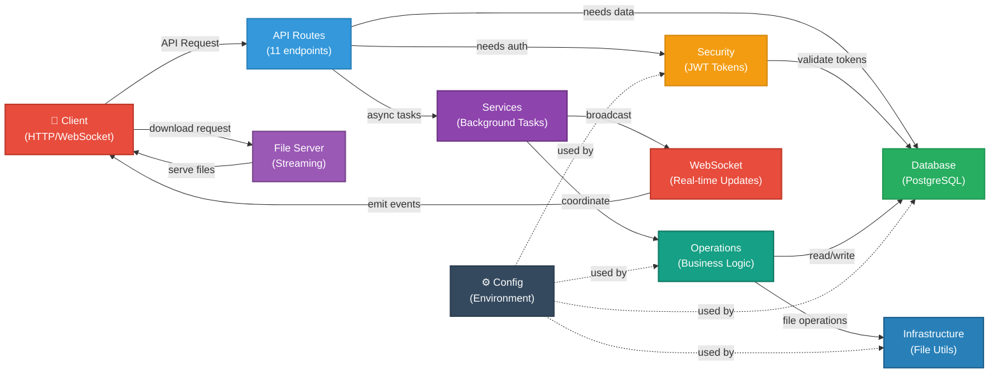

# AudioBookSync - Visual Dependency Graph (Mermaid)

## Complete System Architecture - Visual Format

```mermaid
graph TD
    subgraph Entry["🚀 Entry Point"]
        ASGI["main.py<br/>(ASGI Application)"]
    end

    subgraph Routes["🛣️ API Routes Layer<br/>(11 Endpoints)"]
        AUTH["auth.py<br/>(Login/Register)"]
        AUDAUTH["audible_auth.py<br/>(Audible OAuth2)"]
        BOOKS["books.py<br/>(Book Ops)"]
        DOWNLOADS["downloads.py<br/>(Download Mgmt)"]
        DECRYPTS["decryptions.py<br/>(Decrypt Mgmt)"]
        FILES["files.py<br/>(File Serving)"]
        LIBRARY["library.py<br/>(Library View)"]
        SYNC["sync.py<br/>(Sync Mgmt)"]
        SETTINGS["settings.py<br/>(User Settings)"]
        WEBSOCKET["websocket.py<br/>(WebSocket)"]
        ERRORS["errors.py<br/>(Error Tracking)"]
    end

    subgraph Security["🔐 Security Layer"]
        AUTHSEC["auth.py<br/>(JWT, Token)"]
        PASSHASH["password.py<br/>(Hash/Verify)"]
    end

    subgraph Middleware["⚙️ Middleware"]
        ERRORHDLR["error_handler.py<br/>(Global Exceptions)"]
        LOGGING["logging.py<br/>(Request Logging)"]
    end

    subgraph WebSockets["🔄 WebSocket Layer"]
        WSMGR["manager.py<br/>(Connection Pool)"]
        EVENTS["events.py<br/>(Event Types)"]
    end

    subgraph Services["🎯 Services Layer"]
        BGSERVICE["background_service.py<br/>(Task Orchestration)<br/>• Download execution<br/>• Decrypt execution<br/>• Error logging<br/>• WebSocket broadcast"]
        SYNCSERVICE["sync_service.py<br/>(Sync Orchestration)"]
    end

    subgraph Operations["⚡ Operations Layer<br/>(Business Logic)"]
        LIBSYNC["library_sync.py<br/>(Main Sync Logic)"]
        DL["downloader.py<br/>(Download Logic)"]
        DECRYPT["decryptor.py<br/>(DRM Decrypt)"]
        DBMGR["db_manager.py<br/>(Transaction Mgr)"]
    end

    subgraph Database["🗄️ Database Layer<br/>(PostgreSQL)"]
        DBPOOL["db_pool.py<br/>(Connection Pool)<br/>10-20 connections"]

        subgraph CoreDB["Core DB Operations"]
            DBUS["db_users.py<br/>(User CRUD)"]
            DBBOOKS["db_books.py<br/>(Book CRUD)"]
            DBDLS["db_downloads.py<br/>(Download Track)"]
            DBDECRYPT["db_decryptions.py<br/>(Decrypt Track)"]
            DBSYNC["db_sync.py<br/>(Sync History)"]
            DBERR["db_errors.py<br/>(Error Logging)"]
        end

        subgraph MetadataDB["Metadata DB Files<br/>(Normalized Tables)"]
            DBMETA["db_book_metadata.py<br/>(JSON Storage)"]
            DBCONTRIB["db_book_contributors.py"]
            DBMEDIA["db_media_info.py"]
            DBPROGRESS["db_reading_progress.py"]
            DBAVAIL["db_book_availability.py"]
            DBCOMPANION["db_companion_materials.py"]
            DBCONTRIBFULL["db_contributors.py"]
        end

        DBAGG["database.py<br/>(Aggregator)<br/>Single import point"]
    end

    subgraph Infrastructure["🔧 Infrastructure Layer"]
        FILEUTIL["file_utils.py<br/>(File Operations)"]
        AUDCLIENT["audible_client.py<br/>(Audible API Client)<br/>(Currently unused)"]
    end

    subgraph Core["🛠️ Core/Config Layer"]
        CONFIG["config.py<br/>(CENTRAL CONFIG)<br/>• Environment vars<br/>• DB URL<br/>• JWT secrets<br/>• File paths"]
        LOGCONFIG["logging_config.py<br/>(Loguru Setup)"]
    end

    %% Route Dependencies
    ASGI -->|registers| AUTH
    ASGI -->|registers| AUDAUTH
    ASGI -->|registers| BOOKS
    ASGI -->|registers| DOWNLOADS
    ASGI -->|registers| DECRYPTS
    ASGI -->|registers| FILES
    ASGI -->|registers| LIBRARY
    ASGI -->|registers| SYNC
    ASGI -->|registers| SETTINGS
    ASGI -->|registers| WEBSOCKET
    ASGI -->|registers| ERRORS

    ASGI -->|uses| ERRORHDLR
    ASGI -->|uses| LOGGING
    ASGI -->|uses| CONFIG
    ASGI -->|initializes| LOGCONFIG

    %% Routes use Security
    AUTH -->|depends on| AUTHSEC
    AUTH -->|depends on| PASSHASH
    AUTH -->|depends on| DBUS

    AUDAUTH -->|depends on| AUTHSEC
    AUDAUTH -->|depends on| DBUS

    BOOKS -->|depends on| AUTHSEC
    BOOKS -->|depends on| DBBOOKS
    BOOKS -->|depends on| ERRORHDLR

    DOWNLOADS -->|depends on| AUTHSEC
    DOWNLOADS -->|depends on| DBDLS
    DOWNLOADS -->|depends on| BGSERVICE
    DOWNLOADS -->|depends on| ERRORHDLR

    DECRYPTS -->|depends on| AUTHSEC
    DECRYPTS -->|depends on| DBDECRYPT
    DECRYPTS -->|depends on| DBDLS
    DECRYPTS -->|depends on| BGSERVICE
    DECRYPTS -->|depends on| ERRORHDLR

    FILES -->|depends on| AUTHSEC
    FILES -->|depends on| DBBOOKS
    FILES -->|depends on| CONFIG
    FILES -->|depends on| ERRORHDLR

    LIBRARY -->|depends on| AUTHSEC
    LIBRARY -->|depends on| DBBOOKS
    LIBRARY -->|depends on| DBUS
    LIBRARY -->|depends on| ERRORHDLR

    SYNC -->|depends on| AUTHSEC
    SYNC -->|depends on| DBSYNC
    SYNC -->|depends on| BGSERVICE
    SYNC -->|depends on| ERRORHDLR

    SETTINGS -->|depends on| AUTHSEC
    SETTINGS -->|depends on| DBUS

    WEBSOCKET -->|depends on| WSMGR
    WEBSOCKET -->|depends on| AUTHSEC

    ERRORS -->|basic endpoint|

    %% Services Dependencies
    BGSERVICE -->|uses| DBDLS
    BGSERVICE -->|uses| DBDECRYPT
    BGSERVICE -->|uses| DBERR
    BGSERVICE -->|uses| LIBSYNC
    BGSERVICE -->|uses| DL
    BGSERVICE -->|uses| DECRYPT
    BGSERVICE -->|uses| WSMGR
    BGSERVICE -->|uses| EVENTS
    BGSERVICE -->|uses| SYNCSERVICE

    SYNCSERVICE -->|uses| DBSYNC
    SYNCSERVICE -->|uses| WSMGR
    SYNCSERVICE -->|uses| EVENTS

    %% Operations Dependencies
    LIBSYNC -->|uses| CONFIG
    LIBSYNC -->|uses| DBUS
    LIBSYNC -->|uses| DBMGR
    LIBSYNC -->|uses| DECRYPT
    LIBSYNC -->|uses| DL

    DL -->|uses| CONFIG
    DL -->|uses| FILEUTIL

    DECRYPT -->|uses| CONFIG
    DECRYPT -->|uses| FILEUTIL

    DBMGR -->|uses| DBBOOKS
    DBMGR -->|uses| DBAGG
    DBMGR -->|uses| DBSYNC

    %% Database Dependencies
    CoreDB -->|all use| DBPOOL
    MetadataDB -->|all use| DBPOOL
    DBAGG -->|aggregates| DBUS
    DBAGG -->|aggregates| DBBOOKS
    DBAGG -->|aggregates| DBDLS
    DBAGG -->|aggregates| DBDECRYPT
    DBAGG -->|aggregates| DBSYNC
    DBAGG -->|aggregates| DBERR

    %% Infrastructure Dependencies
    DL -->|uses| FILEUTIL
    DECRYPT -->|uses| FILEUTIL
    AUDCLIENT -->|available for future use|

    %% Config Dependencies (used everywhere)
    DBPOOL -->|uses| CONFIG
    AUTHSEC -->|uses| CONFIG
    DL -->|uses| CONFIG
    DECRYPT -->|uses| CONFIG
    FILES -->|uses| CONFIG
    LIBSYNC -->|uses| CONFIG

    %% Styling
    classDef entry fill:#ff6b6b,stroke:#c92a2a,color:#fff,stroke-width:3px
    classDef route fill:#4ecdc4,stroke:#088395,color:#fff,stroke-width:2px
    classDef security fill:#ffd93d,stroke:#ff922b,color:#000,stroke-width:2px
    classDef middleware fill:#a8dadc,stroke:#457b9d,color:#000,stroke-width:2px
    classDef websocket fill:#c7ceea,stroke:#6c5ce7,color:#000,stroke-width:2px
    classDef service fill:#ff9ff3,stroke:#fd79a8,color:#000,stroke-width:2px
    classDef operation fill:#f8b739,stroke:#f39c12,color:#000,stroke-width:2px
    classDef database fill:#74b9ff,stroke:#0984e3,color:#fff,stroke-width:2px
    classDef infrastructure fill:#a29bfe,stroke:#6c5ce7,color:#fff,stroke-width:2px
    classDef core fill:#00b894,stroke:#00a86b,color:#fff,stroke-width:3px

    class ASGI entry
    class AUTH,AUDAUTH,BOOKS,DOWNLOADS,DECRYPTS,FILES,LIBRARY,SYNC,SETTINGS,WEBSOCKET,ERRORS route
    class AUTHSEC,PASSHASH security
    class ERRORHDLR,LOGGING middleware
    class WSMGR,EVENTS websocket
    class BGSERVICE,SYNCSERVICE service
    class LIBSYNC,DL,DECRYPT,DBMGR operation
    class DBPOOL,DBUS,DBBOOKS,DBDLS,DBDECRYPT,DBSYNC,DBERR,DBMETA,DBCONTRIB,DBMEDIA,DBPROGRESS,DBAVAIL,DBCOMPANION,DBCONTRIBFULL,DBAGG database
    class FILEUTIL,AUDCLIENT infrastructure
    class CONFIG,LOGCONFIG core
```

---

## Simplified Data Flow



---

## Module Import Relationships (Text Format)

### ✅ Routes → Imports From
```
auth.py               → [auth.py, password.py, db_users, schemas, middleware]
audible_auth.py       → [auth.py, db_users, schemas]
books.py              → [auth.py, db_books, schemas, middleware]
downloads.py          → [auth.py, db_downloads, background_service, schemas, middleware]
decryptions.py        → [auth.py, db_decryptions, db_downloads, background_service, schemas, middleware]
files.py              → [auth.py, db_books, config, middleware]
library.py            → [auth.py, db_books, db_users, schemas, middleware]
sync.py               → [auth.py, db_sync, background_service, schemas, middleware]
settings.py           → [auth.py, db_users, schemas]
websocket.py          → [auth.py, ws_manager]
errors.py             → [fastapi]
```

### ✅ Services → Imports From
```
background_service.py → [db_downloads, db_decryptions, db_errors, operations/*, websocket/*, sync_service]
sync_service.py       → [db_sync, websocket/*]
```

### ✅ Operations → Imports From
```
library_sync.py       → [config, db_users, db_manager, downloader, decryptor]
downloader.py         → [config, file_utils]
decryptor.py          → [config, file_utils]
db_manager.py         → [database.py, db_books, db_sync]
```

### ✅ Database → Imports From
```
All db_* files        → [db_pool]
db_pool.py            → [config]
```

### ✅ Configuration → Imports From
```
config.py             → [external only: os, dotenv]
logging_config.py     → [external only: loguru, sys]
```

---

## Critical Paths (Most Connected Files)

### Files with Most Dependents (High Impact)
1. **config.py** - Used by 12+ files
   - If changed: affects entire system
   - Recommendation: Very stable, minimal changes

2. **db_pool.py** - Used by all database files
   - If changed: affects all DB operations
   - Recommendation: Don't modify unless critical

3. **auth.py (security)** - Used by all 11 routes
   - If changed: affects all authentication
   - Recommendation: Thoroughly test any changes

4. **db_users.py** - Used by 6 files
   - If changed: affects user operations
   - Recommendation: Good test coverage needed

5. **background_service.py** - Used by 3 routes
   - If changed: affects async operations
   - Recommendation: Test async thoroughly

### Files with Most Dependencies (Complex)
1. **background_service.py** - Imports from 6 modules
2. **library_sync.py** - Imports from 5 modules
3. **main.py** - Imports from 11 routes + middleware

### Safest Files to Modify (No Dependents)
- Metadata database files (low impact, internal use only)
- audible_client.py (not currently used)
- Individual utility modules

---

## Key Insights

### ✅ Strengths
- **No circular dependencies** - Clean unidirectional flow
- **Clear layering** - Each tier has distinct purpose
- **Central configuration** - Single source of truth
- **Connection pooling** - Efficient database usage
- **Async throughout** - High concurrency support

### ⚠️ Areas of Caution
- `config.py` is a critical dependency - changes affect everything
- `db_pool.py` manages all database connections - very sensitive
- `background_service.py` is complex with many responsibilities

### 🔄 Dependency Directions
```
Routes → Services → Operations → Database → Config
  ↑                                          ↓
  └──────────────────────────────────────────┘
  (Config used by all layers)
```

